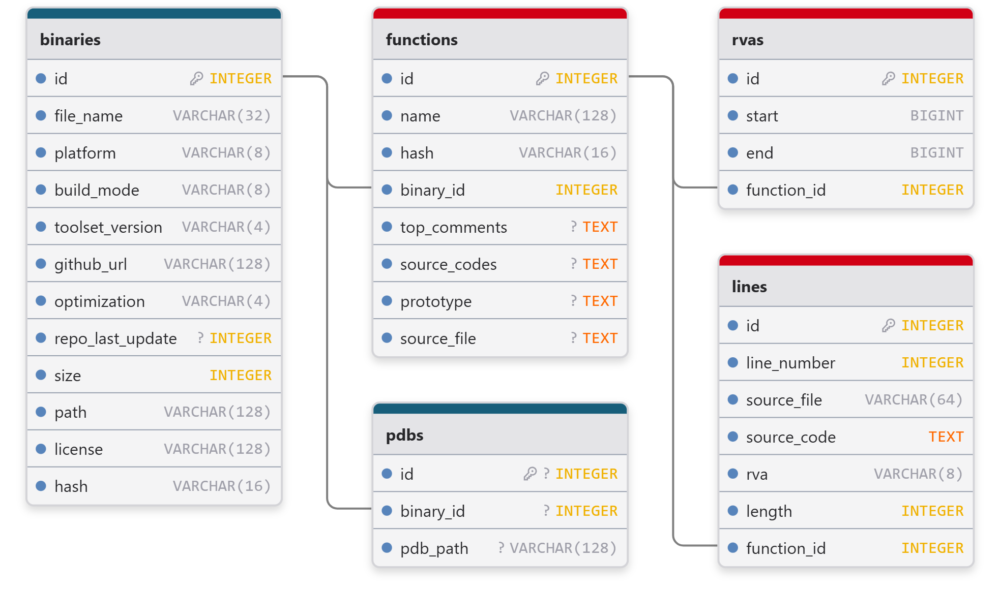

dataset
=======

.. autosummary::
   :toctree: generated

Overview
--------

Assemblage provides datasets on various build configurations, such as CPU arch, compiler, and optimization flags.
Due to the nature of different tool chains, the datasets are distributed mainly based on the source and tool chain, such as vcpkg on Windows, and Github on Linux.

You can find the `Datasheet <https://assemblage-dataset.net/assets/total-datasheet.pdf>`_ of the whole dataset

.. note::
    Currently we are only releaseing binaries built from repositories that have license.

+-------------+---------------+---------+-------+----------+
| Data source | Compiler      | OS      | Count | Licensed |
+=============+===============+=========+=======+==========+
| GitHub      | Visual Studio | Windows | 960k  | 64k      |
+-------------+---------------+---------+-------+----------+
| GitHub      | GCC/Clang     | Linux   | 428k  | 211k     |
+-------------+---------------+---------+-------+----------+
| vcpkg       | Visual Studio | Windows | 29k   | 29k      |
+-------------+---------------+---------+-------+----------+

Distribution Format
-------------------

The dataset is distributed in the following format:

#. A compressed file containing the binaries
#. A SQLite database containing the metadata of the binaries

You can find the detailed schema also in the Datasheet. While the database provides detailed information about the binaries,
the compressed file contains the binaries themselves. The binaries are stored in the location indicated by the ``path`` field in the database.

Also, you may need to use some Python modules to load function related data from the SQLite database for faster access. The following code snippet shows how to load data from the SQLite database into dataframe,

.. code-block:: python

      import sqlite3
      import pandas as pd
   
      conn = sqlite3.connect('path/to/sqlite.db')
      df = pd.read_sql_query("SELECT f.name, r.start\
                              FROM rvas r\
                              JOIN functions f ON r.function_id = f.id\
                              JOIN binaries ON f.binary_id = binaries.id\
                              WHERE binaries.id = some_id\
                              ORDER BY r.start ASC;", conn)
      conn.close()
   
      print(df.head())

and some other useful SQL queries are as follows,

.. code-block:: sql

      -- Count functions of binaries size more than 100KB
      SELECT COUNT(*) FROM functions
      WHERE binary_id IN (SELECT id FROM binaries WHERE size>100);

      -- Select binary information and RVA by function id:
      SELECT f.id, f.name, r.start, 
      b.id, b.toolset_version, b.optimization, b.github_url
      FROM functions
      WHERE functions.id=some_id 
      JOIN rvas r ON r.function_id=f.id 
      JOIN binaries b ON b.id=f.binary_id;

      -- Dump all function name, rva address and binary id:
      SELECT f.name, f.binary_id, r.start 
      FROM functions f JOIN rvas r ON f.id==r.function_id;

      -- Dump ascending function name and rva starts for binary some_id
      SELECT f.name,  r.start
      FROM rvas r
      JOIN functions f ON r.function_id = f.id
      JOIN binaries ON f.binary_id = binaries.id
      WHERE binaries.id = some_id
      ORDER BY r.start ASC;

Dataset location
----------------

The dataset is available at the following locations, currently hosted on Hugging Face,

#. Windows GitHub dataset (~100k, last update: May 27th):

   https://huggingface.co/datasets/changliu8541/Assemblage_PE

#. Windows vcpkg dataset (56k, last update: May 25th):

   https://huggingface.co/datasets/changliu8541/Assemblage_vcpkgDLL

#. Linux GitHub dataset (211k):

   https://huggingface.co/datasets/changliu8541/Assemblage_LinuxELF