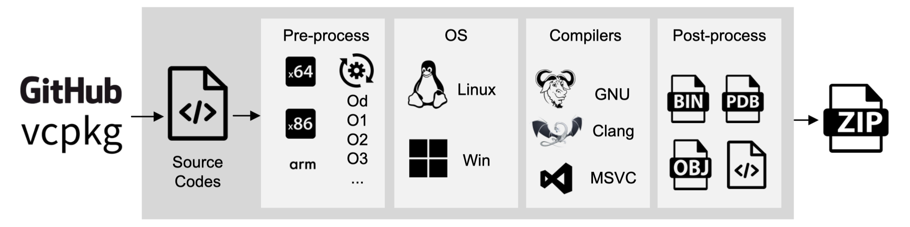

Dataset Access
===============

.. autosummary::
   :toctree: generated

Overview
--------

Assemblage provides datasets on various build configurations, such as CPU arch, compiler, and optimization flags.
Due to the nature of different tool chains, the datasets are distributed mainly based on the source and tool chain, such as vcpkg on Windows, and Github on Linux.

+-------------+---------------+---------+-------+----------+
| Data source | Compiler      | OS      | Count | Licensed |
+=============+===============+=========+=======+==========+
| GitHub      | Visual Studio | Windows | 960k  | 120k     |
+-------------+---------------+---------+-------+----------+
| GitHub      | GCC/Clang     | Linux   | 428k  | 211k     |
+-------------+---------------+---------+-------+----------+
| vcpkg       | Visual Studio | Windows | 130k  | 130k     |
+-------------+---------------+---------+-------+----------+

.. note::
   Currently we are only releasing binaries built from repositories that have license. 
   Please adhere to the license of the original repositories when using the dataset.

Distribution Format
-------------------

The dataset is distributed in the following format:

#. A compressed file of the binaries
#. A SQLite database containing the metadata (GitHub url, functions address, source codes, etc.) of the binaries

.. image:: assets/sqlite_schema.png
  :width: 800
  :alt: SQLite database schema

You can find the detailed schema also in the Datasheet. While the database provides detailed information about the binaries,
the compressed file contains the binaries themselves. The binaries are stored in the location indicated by the ``path`` field in the database.

Use Assemblage with Python and SQLite
~~~~~~~~~~~~~~~~~~~~~~~~~~~~~~~~~~~~~

Also, you may need to use some Python modules to load function related data from the SQLite database for faster access. The following code snippet shows how to load data from the SQLite database into dataframe,

.. code-block:: python

      import sqlite3
      import pandas as pd
   
      conn = sqlite3.connect('path/to/sqlite.db')
      df = pd.read_sql_query("SELECT f.name, r.start\
                              FROM rvas r\
                              JOIN functions f ON r.function_id = f.id\
                              JOIN binaries ON f.binary_id = binaries.id\
                              WHERE binaries.id = some_id\
                              ORDER BY r.start ASC;", conn)
      conn.close()
   
      print(df.head())

and some other useful SQL queries are as follows,

.. code-block:: sql

      -- Count functions of binaries size more than 100KB
      SELECT COUNT(*) FROM functions
      WHERE binary_id IN (SELECT id FROM binaries WHERE size>100);

      -- Select binary information and RVA by function id:
      SELECT f.id, f.name, r.start, 
      b.id, b.toolset_version, b.optimization, b.github_url
      FROM functions
      WHERE functions.id=some_id 
      JOIN rvas r ON r.function_id=f.id 
      JOIN binaries b ON b.id=f.binary_id;

      -- Dump all function name, rva address and binary id:
      SELECT f.name, f.binary_id, r.start 
      FROM functions f JOIN rvas r ON f.id==r.function_id;

      -- Dump ascending function name and rva starts for binary some_id
      SELECT f.name,  r.start
      FROM rvas r
      JOIN functions f ON r.function_id = f.id
      JOIN binaries ON f.binary_id = binaries.id
      WHERE binaries.id = some_id
      ORDER BY r.start ASC;

Dump SQL file
~~~~~~~~~~~~~
If you are not satisfying with SQLite's querying speed (which is slow compared to other database servers), you can also dump the database into SQL, then load into 
your preferred database solution.

.. code-block:: sql

   .output assemblage.sql
   .dump
   .quit

License information
~~~~~~~~~~~~~~~~~~

We are also provide the license information as a JSON file for your convenience (each GitHub URL maps to its license). The file can be found here

   :download:`license.json <assets/license.json>`

Tips on PDB files
~~~~~~~~~~~~~~~~~

If you are using PDB files with IDA Pro, 
you need to sort out the file and put pdb files (sometimes the pdb file name also matters for IDA to realize that these pdbs are for the binary) 
along with binary file in one folder.

.. code-block:: python

   import ...

   connection = sqlite3.connect("db.sqlite")
   cursor = connection.cursor()
   infos = cursor.execute('SELECT id, path, file_name, optimization, github_url, toolset_version FROM binaries;')
   for binid, path, file_name, opt, github_url,toolset_version in tqdm(infos):
      full_path = os.path.join(dataset_path, path.replace("\\", "/"))
      if not os.path.isdir(os.path.join(flatten_dir, str(binid))):
         os.makedirs(os.path.join(flatten_dir, str(binid)))
      shutil.copy(full_path, os.path.join(flatten_dir, str(binid), file_name))
      subcursor = connection.cursor()
      pdbs = subcursor.execute('SELECT DISTINCT(pdb_path) FROM pdbs where binary_id = ?', (binid,))
      for pdb in pdbs:
         full_path = os.path.join(dataset_path, pdb[0].replace("\\", "/"))
         shutil.copy(full_path, os.path.join(flatten_dir, str(binid), os.path.basename(os.path.basename(pdb[0]).split("_")[-1])))

.. warning::
   **Linux dataset GCC-Oz optimization** Updated November 2025: There may be an issue with passing the -Oz flag to the GCC compiler in the Linux dataset; and binaries marked as '-Oz' optimization may have actually been built with '-Os', or with the repository's original Makefile compiler flag. An update to the dataset has been made with new GCC-O2 binaries.

Dataset Access
----------------

The dataset is available at the following locations, currently hosted on Hugging Face and Kaggle,

#. Sample dataset (~600 binaries, 500MB):

   https://www.kaggle.com/datasets/changliuh7rfs5/assemblage-sample

#. Windows GitHub dataset (~100k, last update: May 27th):

   https://huggingface.co/datasets/changliu8541/Assemblage_PE
   
   https://www.kaggle.com/datasets/changliuh7rfs5/assemblagedataset

#. Windows vcpkg dataset (130k, last update June 12th):

   https://huggingface.co/datasets/changliu8541/Assemblage_vcpkgDLL

   https://www.kaggle.com/datasets/changliuh7rfs5/assemblage-vcpkg

#. Linux GitHub dataset (211k, last updated July 20th):

   https://huggingface.co/datasets/changliu8541/Assemblage_LinuxELF

   https://www.kaggle.com/datasets/changliuh7rfs5/assemblagelinux

