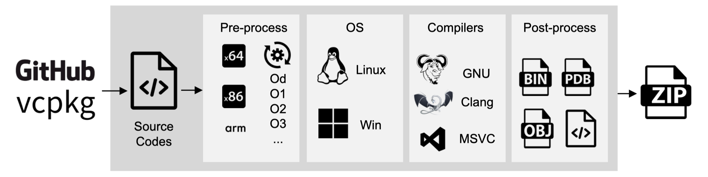
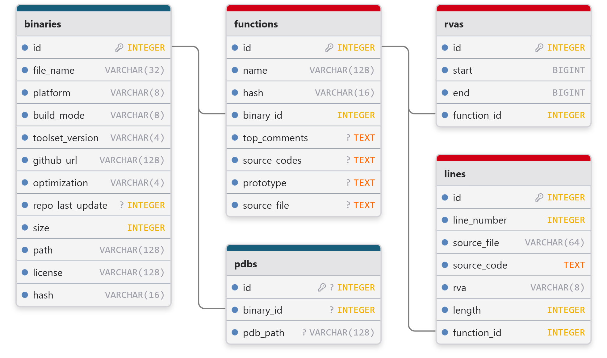

Dataset Access
==============

Overview
--------

Assemblage publishes several datasets, split by source and toolchain: GitHub
repositories built on Linux (C/C++, and separately Rust), GitHub repositories
built on Windows, vcpkg packages built on Windows, and DeepHistory, a corpus
of library releases spanning several years. Every binary records the
configuration it was built with (compiler, optimization level, build mode)
and, where debug information was available, the functions, address ranges
and source lines inside it.

.. note::
   Only binaries built from repositories that carry a license are released.
   The Assemblage code is MIT licensed; each binary keeps the license of the
   repository it was built from, which is recorded per binary. Follow that
   license when using the data.

All datasets are hosted on Hugging Face. The Kaggle copies are no longer
updated because of file size limits.

Datasets
--------

.. list-table::
   :header-rows: 1
   :widths: 18 36 30 16

   * - Dataset
     - Contents
     - Format
     - Last update
   * - `Rust GitHub <https://huggingface.co/datasets/changliu8541/assemblage-rust>`_
     - 127,165 ELF binaries from 77,004 builds of 10,766 repositories, with
       DWARF metadata, the source tree of every build, and compiler IR for
       17,174 builds. 1.75 TB.
     - one tar per repository, JSON metadata (see below)
     - 2026 August
   * - `Linux GitHub <https://huggingface.co/datasets/changliu8541/Assemblage_LinuxELF>`_
     - 249,121 ELF binaries built with gcc and clang; 613 million functions,
       685 million address ranges, 4.0 billion lines
     - DuckDB ``linux_licensed.duckdb.zst`` (127 GiB unpacked) and
       ``binaries.tar.xz``
     - 2026 May
   * - `Windows GitHub <https://huggingface.co/datasets/changliu8541/Assemblage_PE>`_
     - 91k PE binaries built with MSVC
     - ``binaries.csv``, ``functions.csv``, ``binaries.tar.xz``,
       ``winpe_pdbs.sqlite.tar.xz``
     - 2025 May
   * - `Windows vcpkg <https://huggingface.co/datasets/changliu8541/Assemblage_vcpkgDLL>`_
     - 130k DLLs built from vcpkg ports, with PDB files
     - SQLite (split ``vcpkg.sqlite.tar.xz.*``) and ``vcpkg_final.tar.xz``
     - 2024 June
   * - `DeepHistory <https://huggingface.co/datasets/changliu8541/assemblage-deephistory>`_
     - 73,610 binaries from 248 projects across their release histories,
       Linux and Windows, with 329 CVEs mapped to functions
     - DuckDB ``deephistory.duckdb.tar.zst`` and ``binaries.tar.zst``
     - 2026 May

Source code for the Linux GitHub dataset (about 1.5 TB compressed, with git
history) is available on request; see Contact on the front page.

Rust GitHub dataset
-------------------

Layout
~~~~~~

.. code-block:: text

   repos/{owner}__{name}.tar          one uncompressed tar per repository
   repos2/                            overflow (Hugging Face allows 10,000 files per directory)
   sources/{owner}__{name}.tar.gz     the git checkout each build used, .git included
   sources2/                          overflow
   sources/manifest.json
   index.jsonl                        one line per build
   LICENSES.csv                       build directory, repository URL, commit, license

``index.jsonl`` rows carry ``build_dir``, ``tar``, ``repo_url``, ``commit``,
``license``, ``binaries`` (count), ``has_metadata``, ``has_ir``,
``stored_bytes`` and, when a build had binaries dropped for size,
``binaries_excluded_oversize``. Treat ``repos`` and ``repos2`` as one
namespace; the ``tar`` field is the path to use.

Each tar holds one directory per build of that repository:

.. code-block:: text

   {owner}_{project}_{sha12}-{flag}-{backend}-{mode}/
       binaries/{name}.zst                 zstd level 12
       metadata/assemblage_meta.json.zst   zstd level 12
       ir/{stage}.tar.gz                   only for builds with IR dumps
       export.json                         source prefix, byte counts, repo_url, commit, license

``flag`` is ``O0`` to ``O3``, ``Os`` or ``Oz``; ``backend`` is ``llvm``,
``cranelift`` or ``gcc``; ``mode`` is ``RelWithDebInfo``, ``Release`` or
``Debug``. All builds use ``nightly-2026-06-15`` for
``x86_64-unknown-linux-gnu`` with v0 symbol mangling.

.. list-table::
   :header-rows: 1
   :widths: 20 80

   * - Dimension
     - Builds
   * - backend
     - llvm 50,765; gcc 16,064; cranelift 10,175
   * - build mode
     - RelWithDebInfo 43,862; Release 25,716; Debug 7,426
   * - optimization
     - O2 20,143; O0 14,825; Os 12,474; O3 11,512; Oz 9,677; O1 8,373

IR dumps (``llvm-ir``, ``mir``, ``asm``, ``hir``, ``thir``) exist for the
``llvm``/``RelWithDebInfo`` builds and cover only the repository's own
crates, not dependencies.

Metadata
~~~~~~~~

``assemblage_meta.json`` describes the build and every binary in it:

.. code-block:: text

   Platform, Build_mode, Compiler, Compiler_version, URL, Commit, Optimization,
   Pushed_at, compiler_flag, language, library,
   Codegen_backend, Toolchain, Mangling, Backend_caps, Cargo_locked,
   Binary_info_list: [
     { file,
       functions: [
         { function_name, demangled_name, origin, source_file, intersect_ratio,
           function_info: [ { rva_start, rva_end } ],
           lines: [ { line_number, rva, length, source_code, source_file } ] } ] } ]

``origin`` is ``in_repo``, ``dependency`` or ``stdlib``, so repository code
can be separated from crates.io and standard library code compiled into the
same binary.

Limitations
~~~~~~~~~~~

* About 23% of builds are metadata-only: library-only crates produce no
  executable, and the build is kept with its metadata.
* About 26% of builds with binaries have an empty or partial function list,
  because extraction is skipped above a size limit and stopped after a time
  limit.
* ``Release`` builds carry little repository DWARF; repository symbols are
  still in ``.symtab``.
* ``gcc`` backend builds have correct names and addresses, but repository
  source file and line information is mostly missing.
* Binaries above 1 GiB uncompressed are left out of the tars and listed in
  ``index.jsonl``. 24 such binaries published before this rule remain.

Reading a build
~~~~~~~~~~~~~~~

.. code-block:: python

   import json, tarfile
   rows = [json.loads(line) for line in open("index.jsonl")]
   row = next(r for r in rows if r["binaries"] > 0)
   with tarfile.open(row["tar"]) as tar:
       tar.extractall("out")
   # out/{build_dir}/metadata/assemblage_meta.json.zst  ->  zstd -d

Database datasets
-----------------

The Linux GitHub, Windows GitHub, Windows vcpkg and DeepHistory datasets
ship a database plus an archive of the binaries. The ``path`` (or
``binary_path``) column of ``binaries`` locates a file inside the archive;
files can also be found by their hash.

* ``binaries``: one row per file, with platform, build mode, toolset
  version, optimization, repository URL, commit, license, size and hash.
* ``functions``: one row per function, with name, source file, source text
  and the binary it belongs to.
* ``rvas``: address ranges of a function (a function can have several).
* ``lines``: source lines with their address and length.
* ``pdbs``: PDB file paths for Windows binaries.
* ``cve_binary_function`` (DeepHistory only): which functions in which
  binaries are affected by which CVE.

The Linux GitHub and DeepHistory databases are DuckDB; the Windows GitHub
and vcpkg databases are SQLite. DuckDB reads SQLite files directly through
its ``sqlite`` extension, so one query interface covers all of them:

.. code-block:: python

   import duckdb
   con = duckdb.connect("linux_licensed.duckdb", read_only=True)
   con.sql("""
       SELECT platform, build_mode, optimization, count(*) AS n
       FROM binaries GROUP BY ALL ORDER BY n DESC
   """).show()

DeepHistory binaries are stored as ``binaries/<XX>/<YY>[/<ZZ>]/<filename>``;
its ELF binaries are stripped, and its PE binaries come with PDB files.

Changes
-------

#. **2024 June.** Linux GitHub dataset: license information updated.
#. **2025 November.** ``-Oz`` labels in the Linux GitHub dataset were found
   to be unreliable: those binaries may have been built with ``-Os`` or with
   the flags of the repository's own build files. GCC ``-O2`` binaries were
   added in their place. Other flags are not affected.
#. **2026 May.** DeepHistory released. The Linux GitHub dataset moved from
   SQLite to DuckDB, and its function, address and line tables were
   re-extracted with a rewritten DWARF pipeline (function naming, end
   addresses, line programs, source text, section pseudo-symbols), checked
   against an independent DWARF walk on a 160-binary sample.
#. **2026 August.** Rust GitHub dataset released.
